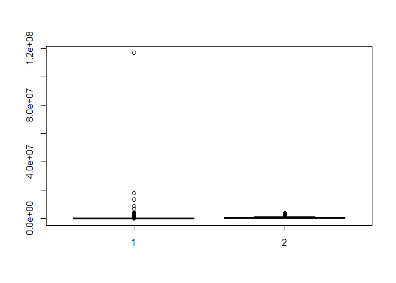
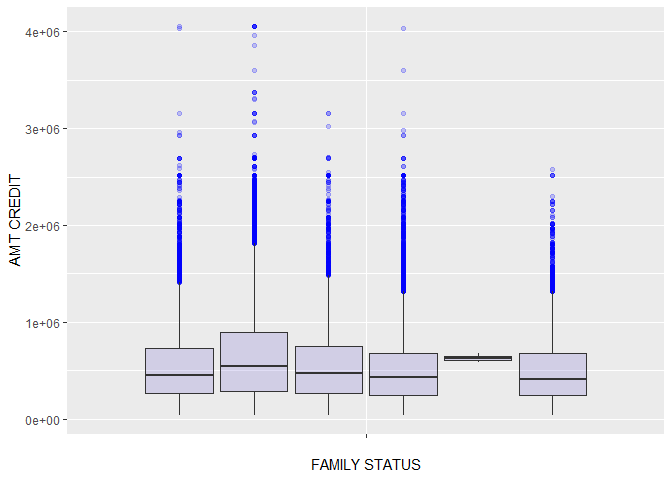
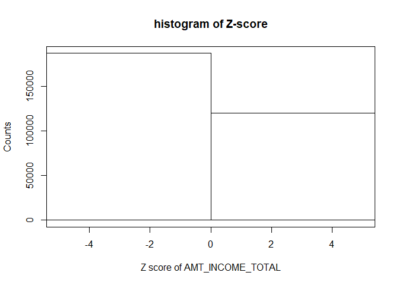
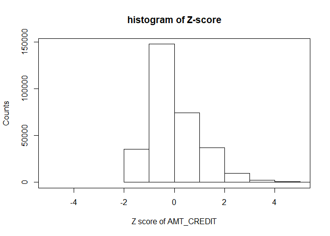
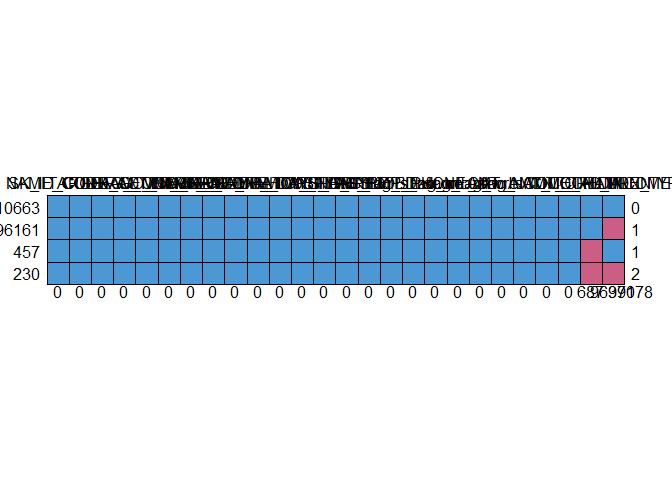
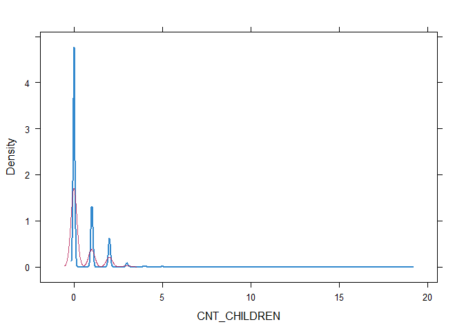
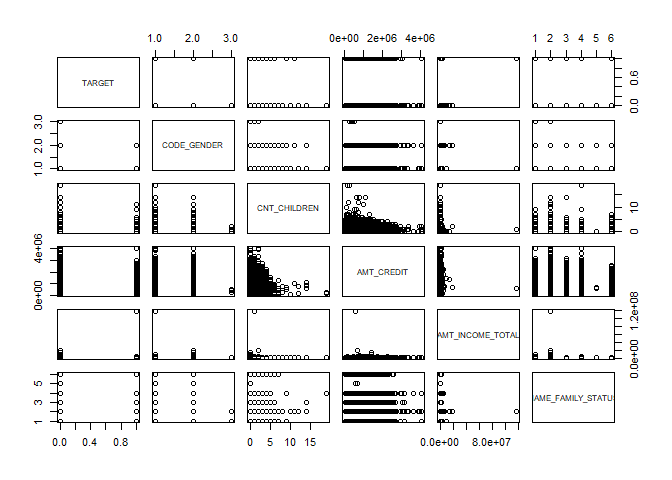

EDA and Preprocessing for the Loan Dataset
================
Aaradhya Mehta, Lavanya Kanagaraj, Ryan Scolaro, and Vamsi Veginati

Import the data and view a summary and missing values.
------------------------------------------------------

``` r
loan.data <- read.csv(file="application_train.csv", header=TRUE, sep=",", na.strings = c("", "NA"))
attach(loan.data)
summary(loan.data)
```

    ##    SK_ID_CURR         TARGET              NAME_CONTRACT_TYPE CODE_GENDER 
    ##  Min.   :100002   Min.   :0.00000   Cash loans     :278232   F  :202448  
    ##  1st Qu.:189146   1st Qu.:0.00000   Revolving loans: 29279   M  :105059  
    ##  Median :278202   Median :0.00000                            XNA:     4  
    ##  Mean   :278181   Mean   :0.08073                                        
    ##  3rd Qu.:367143   3rd Qu.:0.00000                                        
    ##  Max.   :456255   Max.   :1.00000                                        
    ##                                                                          
    ##  FLAG_OWN_CAR FLAG_OWN_REALTY  CNT_CHILDREN    AMT_INCOME_TOTAL   
    ##  N:202924     N: 94199        Min.   : 0.000   Min.   :    25650  
    ##  Y:104587     Y:213312        1st Qu.: 0.000   1st Qu.:   112500  
    ##                               Median : 0.000   Median :   147150  
    ##                               Mean   : 0.418   Mean   :   168798  
    ##                               3rd Qu.: 1.000   3rd Qu.:   202500  
    ##                               Max.   :19.000   Max.   :117000000  
    ##                               NA's   :687                         
    ##    AMT_CREDIT                  NAME_INCOME_TYPE 
    ##  Min.   :  45000   Working             :158774  
    ##  1st Qu.: 270000   Commercial associate: 71617  
    ##  Median : 513531   Pensioner           : 55362  
    ##  Mean   : 599026   State servant       : 21703  
    ##  3rd Qu.: 808650   Unemployed          :    22  
    ##  Max.   :4050000   Student             :    18  
    ##                    (Other)             :    15  
    ##                     NAME_EDUCATION_TYPE            NAME_FAMILY_STATUS
    ##  Academic degree              :   164   Civil marriage      : 29775  
    ##  Higher education             : 74863   Married             :196432  
    ##  Incomplete higher            : 10277   Separated           : 19770  
    ##  Lower secondary              :  3816   Single / not married: 45444  
    ##  Secondary / secondary special:218391   Unknown             :     2  
    ##                                         Widow               : 16088  
    ##                                                                      
    ##            NAME_HOUSING_TYPE    DAYS_BIRTH     DAYS_EMPLOYED   
    ##  Co-op apartment    :  1122   Min.   :-25229   Min.   :-17912  
    ##  House / apartment  :272868   1st Qu.:-19682   1st Qu.: -2760  
    ##  Municipal apartment: 11183   Median :-15750   Median : -1213  
    ##  Office apartment   :  2617   Mean   :-16037   Mean   : 63815  
    ##  Rented apartment   :  4881   3rd Qu.:-12413   3rd Qu.:  -289  
    ##  With parents       : 14840   Max.   : -7489   Max.   :365243  
    ##                                                                
    ##    FLAG_MOBIL FLAG_EMP_PHONE      OCCUPATION_TYPE 
    ##  Min.   :0    Min.   :0.0000   Laborers   :55186  
    ##  1st Qu.:1    1st Qu.:1.0000   Sales staff:32102  
    ##  Median :1    Median :1.0000   Core staff :27570  
    ##  Mean   :1    Mean   :0.8199   Managers   :21371  
    ##  3rd Qu.:1    3rd Qu.:1.0000   Drivers    :18603  
    ##  Max.   :1    Max.   :1.0000   (Other)    :56288  
    ##                                NA's       :96391

``` r
sapply(loan.data, function(x) sum(is.na(x)))
```

    ##          SK_ID_CURR              TARGET  NAME_CONTRACT_TYPE 
    ##                   0                   0                   0 
    ##         CODE_GENDER        FLAG_OWN_CAR     FLAG_OWN_REALTY 
    ##                   0                   0                   0 
    ##        CNT_CHILDREN    AMT_INCOME_TOTAL          AMT_CREDIT 
    ##                 687                   0                   0 
    ##    NAME_INCOME_TYPE NAME_EDUCATION_TYPE  NAME_FAMILY_STATUS 
    ##                   0                   0                   0 
    ##   NAME_HOUSING_TYPE          DAYS_BIRTH       DAYS_EMPLOYED 
    ##                   0                   0                   0 
    ##          FLAG_MOBIL      FLAG_EMP_PHONE     OCCUPATION_TYPE 
    ##                   0                   0               96391

The missing occupation variables and employee phone variables do not seem to be related.
----------------------------------------------------------------------------------------

``` r
count(loan.data, vars = c("OCCUPATION_TYPE","FLAG_EMP_PHONE"))
```

    ##          OCCUPATION_TYPE FLAG_EMP_PHONE  freq
    ## 1            Accountants              0     1
    ## 2            Accountants              1  9812
    ## 3         Cleaning staff              0     2
    ## 4         Cleaning staff              1  4651
    ## 5          Cooking staff              1  5946
    ## 6             Core staff              1 27570
    ## 7                Drivers              0     2
    ## 8                Drivers              1 18601
    ## 9  High skill tech staff              0     1
    ## 10 High skill tech staff              1 11379
    ## 11              HR staff              1   563
    ## 12              IT staff              1   526
    ## 13              Laborers              0     2
    ## 14              Laborers              1 55184
    ## 15    Low-skill Laborers              1  2093
    ## 16              Managers              0     2
    ## 17              Managers              1 21369
    ## 18        Medicine staff              1  8537
    ## 19 Private service staff              1  2652
    ## 20         Realty agents              1   751
    ## 21           Sales staff              0     1
    ## 22           Sales staff              1 32101
    ## 23           Secretaries              1  1305
    ## 24        Security staff              1  6721
    ## 25  Waiters/barmen staff              1  1348
    ## 26                  <NA>              0 55375
    ## 27                  <NA>              1 41016

Create a box plot of income and credit. The first has graph has no parameters besides the data, while the second groups the data by family status. Grouping can help graph continuous variables, but the presense of very large outliers still makes the plot hard to read.
---------------------------------------------------------------------------------------------------------------------------------------------------------------------------------------------------------------------------------------------------------------------------

``` r
boxplot(loan.data$AMT_INCOME_TOTAL,loan.data$AMT_CREDIT)
```



``` r
(fs <- ggplot(loan.data, aes(x="", y=AMT_CREDIT, group=NAME_FAMILY_STATUS)) + 
  geom_boxplot(fill="slateblue", alpha=0.2,outlier.color="blue") + 
  xlab("FAMILY STATUS")+ylab("AMT CREDIT"))
```



#### These plots show the presense of some large outliers, though we will not remove them for now.

------------------------------------------------------------------------

Create flag variables for the family status variable.
-----------------------------------------------------

``` r
loan.data$flag_s_not_m <- 0
loan.data$flag_m <- 0
loan.data$flag_c_m <- 0
loan.data$flag_w <- 0
loan.data$flag_s <- 0
#unknown will be if all flags are 0
#first single not married - change new field to 1 depending on
#flag family status, this can be used for logistic regression
loan.data$flag_s_not_m[loan.data$NAME_FAMILY_STATUS == 'Single / not married'] <- 1
#continue for all other fields
loan.data$flag_m[loan.data$NAME_FAMILY_STATUS == 'Married'] <- 1
loan.data$flag_c_m[loan.data$NAME_FAMILY_STATUS == 'Civil Marriage'] <- 1
loan.data$flag_w[loan.data$NAME_FAMILY_STATUS == 'Widow'] <- 1
loan.data$flag_s[loan.data$NAME_FAMILY_STATUS == 'Separated'] <- 1
#oounts (dplyr)
count(loan.data, 'flag_s_not_m')
```

    ##   flag_s_not_m   freq
    ## 1            0 262067
    ## 2            1  45444

``` r
count(loan.data, 'flag_m')
```

    ##   flag_m   freq
    ## 1      0 111079
    ## 2      1 196432

``` r
count(loan.data, 'flag_c_m')
```

    ##   flag_c_m   freq
    ## 1        0 307511

``` r
count(loan.data, 'flag_w')
```

    ##   flag_w   freq
    ## 1      0 291423
    ## 2      1  16088

``` r
count(loan.data, 'flag_s')
```

    ##   flag_s   freq
    ## 1      0 287741
    ## 2      1  19770

Standardize income and calculate its skewness.
----------------------------------------------

``` r
loan.data$zscore.AMT_INCOME_TOTAL <- (AMT_INCOME_TOTAL - mean(AMT_INCOME_TOTAL))/sd(AMT_INCOME_TOTAL)
hist(loan.data$zscore.AMT_INCOME_TOTAL, breaks=11,xlim=c(-5,5), main="histogram of Z-score",
     xlab="Z score of AMT_INCOME_TOTAL",ylab="Counts")
box(which = "plot", lty="solid", col="black")
```



``` r
AMT_INCOME_TOTAL_skew <- (3*(mean(AMT_INCOME_TOTAL)-median(AMT_INCOME_TOTAL))) / sd(AMT_INCOME_TOTAL)
AMT_INCOME_TOTAL_skew
```

    ## [1] 0.273882

#### Income is not normally distributed.

------------------------------------------------------------------------

Check for outliers in income.
-----------------------------

``` r
cat("Number of lower range outliers: ", length(loan.data$zscore.AMT_INCOME_TOTAL[loan.data$zscore.AMT_INCOME_TOTAL < -3]))
```

    ## Number of lower range outliers:  0

``` r
cat("Number of upper range outliers: ", length(loan.data$zscore.AMT_INCOME_TOTAL[loan.data$zscore.AMT_INCOME_TOTAL > 3]))
```

    ## Number of upper range outliers:  454

Standardize credit and calculate its skewness.
----------------------------------------------

``` r
loan.data$zscore.AMT_CREDIT <- (AMT_CREDIT - mean(AMT_CREDIT))/sd(AMT_CREDIT)
hist(loan.data$zscore.AMT_CREDIT, breaks=11,xlim=c(-5,5), main="histogram of Z-score",
     xlab="Z score of AMT_CREDIT",ylab="Counts")
box(which = "plot", lty="solid", col="black")
```



``` r
AMT_CREDIT_skew <- (3*(mean(AMT_CREDIT)-median(AMT_CREDIT))) / sd(AMT_CREDIT)
AMT_CREDIT_skew
```

    ## [1] 0.6372444

#### Credit is not normally distributed.

------------------------------------------------------------------------

Check for outliers in credit.
-----------------------------

``` r
cat("Number of lower range outliers: ", length(loan.data$zscore.AMT_CREDIT[loan.data$zscore.AMT_CREDIT < -3]))
```

    ## Number of lower range outliers:  0

``` r
cat("Number of upper range outliers: ", length(loan.data$zscore.AMT_CREDIT[loan.data$zscore.AMT_CREDIT > 3]))
```

    ## Number of upper range outliers:  3255

Decision for outliers and normality.
------------------------------------

#### Since there are outliers the first setp would be to remove them using something like the IQR method. Then we can check for normality again without the outliers. If the data still is not normal we can try to transform the data to reach normality using the natural log or square root transformations.

------------------------------------------------------------------------

Bin the income variable.
------------------------

``` r
loan.data$CAT_AMT_TOTAL_INCOME[loan.data$AMT_INCOME_TOTAL > 0 & loan.data$AMT_INCOME_TOTAL <= 100000 ] <- "A"
loan.data$CAT_AMT_TOTAL_INCOME[loan.data$AMT_INCOME_TOTAL > 100000 & loan.data$AMT_INCOME_TOTAL <= 150000 ] <- "B"
loan.data$CAT_AMT_TOTAL_INCOME[loan.data$AMT_INCOME_TOTAL > 150000 & loan.data$AMT_INCOME_TOTAL <= 200000 ] <- "C"
loan.data$CAT_AMT_TOTAL_INCOME[loan.data$AMT_INCOME_TOTAL > 200000 & loan.data$AMT_INCOME_TOTAL <= 250000 ] <- "D"
loan.data$CAT_AMT_TOTAL_INCOME[loan.data$AMT_INCOME_TOTAL > 250000 ] <- "E"
```

#### Using equal width binning when outliers are present can cause the binning distibution to be very uneven as a large outlier can cause its bin to be mostly empty, while the other ones are too full. Binning after outlier removal and/or normalization ensures that there will be a more even distribution. Using domain knowledge can also be extremly helpful for binning as you will be able to group by the data's natural clustering which ensures not only even distribution, but also that the bins represent actal patterns in the data.

------------------------------------------------------------------------

Use MICE to replace missing values.
-----------------------------------

``` r
md.pattern(loan.data)
```



    ##        SK_ID_CURR TARGET NAME_CONTRACT_TYPE CODE_GENDER FLAG_OWN_CAR
    ## 210663          1      1                  1           1            1
    ## 96161           1      1                  1           1            1
    ## 457             1      1                  1           1            1
    ## 230             1      1                  1           1            1
    ##                 0      0                  0           0            0
    ##        FLAG_OWN_REALTY AMT_INCOME_TOTAL AMT_CREDIT NAME_INCOME_TYPE
    ## 210663               1                1          1                1
    ## 96161                1                1          1                1
    ## 457                  1                1          1                1
    ## 230                  1                1          1                1
    ##                      0                0          0                0
    ##        NAME_EDUCATION_TYPE NAME_FAMILY_STATUS NAME_HOUSING_TYPE DAYS_BIRTH
    ## 210663                   1                  1                 1          1
    ## 96161                    1                  1                 1          1
    ## 457                      1                  1                 1          1
    ## 230                      1                  1                 1          1
    ##                          0                  0                 0          0
    ##        DAYS_EMPLOYED FLAG_MOBIL FLAG_EMP_PHONE flag_s_not_m flag_m
    ## 210663             1          1              1            1      1
    ## 96161              1          1              1            1      1
    ## 457                1          1              1            1      1
    ## 230                1          1              1            1      1
    ##                    0          0              0            0      0
    ##        flag_c_m flag_w flag_s zscore.AMT_INCOME_TOTAL zscore.AMT_CREDIT
    ## 210663        1      1      1                       1                 1
    ## 96161         1      1      1                       1                 1
    ## 457           1      1      1                       1                 1
    ## 230           1      1      1                       1                 1
    ##               0      0      0                       0                 0
    ##        CAT_AMT_TOTAL_INCOME CNT_CHILDREN OCCUPATION_TYPE      
    ## 210663                    1            1               1     0
    ## 96161                     1            1               0     1
    ## 457                       1            0               1     1
    ## 230                       1            0               0     2
    ##                           0          687           96391 97078

``` r
dataframe_children <- as.data.frame(CNT_CHILDREN)
#note maxit is low due to time for processing can be higher
imputed_Data <- mice(loan.data, m=1, maxit = 2, method = 'cart', seed = 500)
```

    ## 
    ##  iter imp variable
    ##   1   1  CNT_CHILDREN  OCCUPATION_TYPE
    ##   2   1  CNT_CHILDREN  OCCUPATION_TYPE

    ## Warning: Number of logged events: 9

``` r
summary(imputed_Data)
```

    ## Class: mids
    ## Number of multiple imputations:  1 
    ## Imputation methods:
    ##              SK_ID_CURR                  TARGET      NAME_CONTRACT_TYPE 
    ##                      ""                      ""                      "" 
    ##             CODE_GENDER            FLAG_OWN_CAR         FLAG_OWN_REALTY 
    ##                      ""                      ""                      "" 
    ##            CNT_CHILDREN        AMT_INCOME_TOTAL              AMT_CREDIT 
    ##                  "cart"                      ""                      "" 
    ##        NAME_INCOME_TYPE     NAME_EDUCATION_TYPE      NAME_FAMILY_STATUS 
    ##                      ""                      ""                      "" 
    ##       NAME_HOUSING_TYPE              DAYS_BIRTH           DAYS_EMPLOYED 
    ##                      ""                      ""                      "" 
    ##              FLAG_MOBIL          FLAG_EMP_PHONE         OCCUPATION_TYPE 
    ##                      ""                      ""                  "cart" 
    ##            flag_s_not_m                  flag_m                flag_c_m 
    ##                      ""                      ""                      "" 
    ##                  flag_w                  flag_s zscore.AMT_INCOME_TOTAL 
    ##                      ""                      ""                      "" 
    ##       zscore.AMT_CREDIT    CAT_AMT_TOTAL_INCOME 
    ##                      ""                      "" 
    ## PredictorMatrix:
    ##                    SK_ID_CURR TARGET NAME_CONTRACT_TYPE CODE_GENDER
    ## SK_ID_CURR                  0      1                  1           1
    ## TARGET                      1      0                  1           1
    ## NAME_CONTRACT_TYPE          1      1                  0           1
    ## CODE_GENDER                 1      1                  1           0
    ## FLAG_OWN_CAR                1      1                  1           1
    ## FLAG_OWN_REALTY             1      1                  1           1
    ##                    FLAG_OWN_CAR FLAG_OWN_REALTY CNT_CHILDREN
    ## SK_ID_CURR                    1               1            1
    ## TARGET                        1               1            1
    ## NAME_CONTRACT_TYPE            1               1            1
    ## CODE_GENDER                   1               1            1
    ## FLAG_OWN_CAR                  0               1            1
    ## FLAG_OWN_REALTY               1               0            1
    ##                    AMT_INCOME_TOTAL AMT_CREDIT NAME_INCOME_TYPE
    ## SK_ID_CURR                        1          1                1
    ## TARGET                            1          1                1
    ## NAME_CONTRACT_TYPE                1          1                1
    ## CODE_GENDER                       1          1                1
    ## FLAG_OWN_CAR                      1          1                1
    ## FLAG_OWN_REALTY                   1          1                1
    ##                    NAME_EDUCATION_TYPE NAME_FAMILY_STATUS
    ## SK_ID_CURR                           1                  1
    ## TARGET                               1                  1
    ## NAME_CONTRACT_TYPE                   1                  1
    ## CODE_GENDER                          1                  1
    ## FLAG_OWN_CAR                         1                  1
    ## FLAG_OWN_REALTY                      1                  1
    ##                    NAME_HOUSING_TYPE DAYS_BIRTH DAYS_EMPLOYED FLAG_MOBIL
    ## SK_ID_CURR                         1          1             1          1
    ## TARGET                             1          1             1          1
    ## NAME_CONTRACT_TYPE                 1          1             1          1
    ## CODE_GENDER                        1          1             1          1
    ## FLAG_OWN_CAR                       1          1             1          1
    ## FLAG_OWN_REALTY                    1          1             1          1
    ##                    FLAG_EMP_PHONE OCCUPATION_TYPE flag_s_not_m flag_m
    ## SK_ID_CURR                      0               1            1      1
    ## TARGET                          0               1            1      1
    ## NAME_CONTRACT_TYPE              0               1            1      1
    ## CODE_GENDER                     0               1            1      1
    ## FLAG_OWN_CAR                    0               1            1      1
    ## FLAG_OWN_REALTY                 0               1            1      1
    ##                    flag_c_m flag_w flag_s zscore.AMT_INCOME_TOTAL
    ## SK_ID_CURR                0      1      1                       0
    ## TARGET                    0      1      1                       0
    ## NAME_CONTRACT_TYPE        0      1      1                       0
    ## CODE_GENDER               0      1      1                       0
    ## FLAG_OWN_CAR              0      1      1                       0
    ## FLAG_OWN_REALTY           0      1      1                       0
    ##                    zscore.AMT_CREDIT CAT_AMT_TOTAL_INCOME
    ## SK_ID_CURR                         0                    0
    ## TARGET                             0                    0
    ## NAME_CONTRACT_TYPE                 0                    0
    ## CODE_GENDER                        0                    0
    ## FLAG_OWN_CAR                       0                    0
    ## FLAG_OWN_REALTY                    0                    0
    ## Number of logged events:  9 
    ##   it im          dep      meth
    ## 1  0  0               constant
    ## 2  0  0               constant
    ## 3  0  0              collinear
    ## 4  0  0              collinear
    ## 5  0  0              collinear
    ## 6  1  1 CNT_CHILDREN      cart
    ##                                                                                                                                                                                                         out
    ## 1                                                                                                                                                                                                  flag_c_m
    ## 2                                                                                                                                                                                      CAT_AMT_TOTAL_INCOME
    ## 3                                                                                                                                                                                            FLAG_EMP_PHONE
    ## 4                                                                                                                                                                                   zscore.AMT_INCOME_TOTAL
    ## 5                                                                                                                                                                                         zscore.AMT_CREDIT
    ## 6 CODE_GENDERXNA, NAME_INCOME_TYPEMaternity leave, NAME_INCOME_TYPEStudent, NAME_INCOME_TYPEUnemployed, NAME_INCOME_TYPEWorking, NAME_FAMILY_STATUSSeparated, NAME_FAMILY_STATUSUnknown, FLAG_MOBIL, flag_m

``` r
densityplot(imputed_Data)
```



``` r
completedData <- complete(imputed_Data,1)
sapply(completedData, function(x) sum(is.na(x)))
```

    ##              SK_ID_CURR                  TARGET      NAME_CONTRACT_TYPE 
    ##                       0                       0                       0 
    ##             CODE_GENDER            FLAG_OWN_CAR         FLAG_OWN_REALTY 
    ##                       0                       0                       0 
    ##            CNT_CHILDREN        AMT_INCOME_TOTAL              AMT_CREDIT 
    ##                       0                       0                       0 
    ##        NAME_INCOME_TYPE     NAME_EDUCATION_TYPE      NAME_FAMILY_STATUS 
    ##                       0                       0                       0 
    ##       NAME_HOUSING_TYPE              DAYS_BIRTH           DAYS_EMPLOYED 
    ##                       0                       0                       0 
    ##              FLAG_MOBIL          FLAG_EMP_PHONE         OCCUPATION_TYPE 
    ##                       0                       0                       0 
    ##            flag_s_not_m                  flag_m                flag_c_m 
    ##                       0                       0                       0 
    ##                  flag_w                  flag_s zscore.AMT_INCOME_TOTAL 
    ##                       0                       0                       0 
    ##       zscore.AMT_CREDIT    CAT_AMT_TOTAL_INCOME 
    ##                       0                       0

Create a contingency table of family status and housing type.
-------------------------------------------------------------

``` r
table(loan.data$NAME_FAMILY_STATUS, loan.data$NAME_HOUSING_TYPE)
```

    ##                       
    ##                        Co-op apartment House / apartment
    ##   Civil marriage                    75             26058
    ##   Married                          678            178292
    ##   Separated                         66             17178
    ##   Single / not married             276             36409
    ##   Unknown                            0                 1
    ##   Widow                             27             14930
    ##                       
    ##                        Municipal apartment Office apartment
    ##   Civil marriage                      1178              227
    ##   Married                             6386             1728
    ##   Separated                            957              173
    ##   Single / not married                1875              382
    ##   Unknown                                1                0
    ##   Widow                                786              107
    ##                       
    ##                        Rented apartment With parents
    ##   Civil marriage                    616         1621
    ##   Married                          2593         6755
    ##   Separated                         340         1056
    ##   Single / not married             1238         5264
    ##   Unknown                             0            0
    ##   Widow                              94          144

Count the n way frequency for pairs.
------------------------------------

``` r
count(loan.data, vars = c("NAME_FAMILY_STATUS","NAME_HOUSING_TYPE"))
```

    ##      NAME_FAMILY_STATUS   NAME_HOUSING_TYPE   freq
    ## 1        Civil marriage     Co-op apartment     75
    ## 2        Civil marriage   House / apartment  26058
    ## 3        Civil marriage Municipal apartment   1178
    ## 4        Civil marriage    Office apartment    227
    ## 5        Civil marriage    Rented apartment    616
    ## 6        Civil marriage        With parents   1621
    ## 7               Married     Co-op apartment    678
    ## 8               Married   House / apartment 178292
    ## 9               Married Municipal apartment   6386
    ## 10              Married    Office apartment   1728
    ## 11              Married    Rented apartment   2593
    ## 12              Married        With parents   6755
    ## 13            Separated     Co-op apartment     66
    ## 14            Separated   House / apartment  17178
    ## 15            Separated Municipal apartment    957
    ## 16            Separated    Office apartment    173
    ## 17            Separated    Rented apartment    340
    ## 18            Separated        With parents   1056
    ## 19 Single / not married     Co-op apartment    276
    ## 20 Single / not married   House / apartment  36409
    ## 21 Single / not married Municipal apartment   1875
    ## 22 Single / not married    Office apartment    382
    ## 23 Single / not married    Rented apartment   1238
    ## 24 Single / not married        With parents   5264
    ## 25              Unknown   House / apartment      1
    ## 26              Unknown Municipal apartment      1
    ## 27                Widow     Co-op apartment     27
    ## 28                Widow   House / apartment  14930
    ## 29                Widow Municipal apartment    786
    ## 30                Widow    Office apartment    107
    ## 31                Widow    Rented apartment     94
    ## 32                Widow        With parents    144

Are days\_birth and days employed realistic?
--------------------------------------------

#### No, neither of them are. Days\_birth is all negative numbers so at the very least you would need to take the absolute value of it before using it. Days employed also has negative numbers along with positive ones, so simply taking the absolute value of it may make the data inconsistent. It also has a commonly appearing maximum value that is more days than a human lifespan so it clearly is incorrect. In order to use both of these variables it would be very helpful to know how they were encoded initially.

#### To make the days variables easier to work with we could do something like the following, which creates date objects from the columns.

``` r
loan.data$DOB_NEW <- as.Date(DAYS_BIRTH, origin = "1970-01-01")
loan.data$DATE_EMPLOYED_NEW <- as.Date(DAYS_EMPLOYED, origin = "1970-01-01")
```

Next Steps:
-----------

#### To complete pre-processing we would create flag variables for the remaining categorical attributes. Normalize the numeric columns as mentioned above. Try and fix the DAYS columns if it is possible to find out how they are set up. Fix more missing data such as the blank occupation fields. We mainly learned that a lot of the data is unreliable and needs to be fixed or encoded in some way before proper conclusions can be drawn from it.

#### An example of some more preprocessing we could do would be to take a subset of the columns and examine the relationships between as shown below.

``` r
dataset=data.frame(TARGET,CODE_GENDER,CNT_CHILDREN,AMT_CREDIT,AMT_INCOME_TOTAL,NAME_FAMILY_STATUS)
pairs(dataset) # graphically shows the relationship between variables
```


